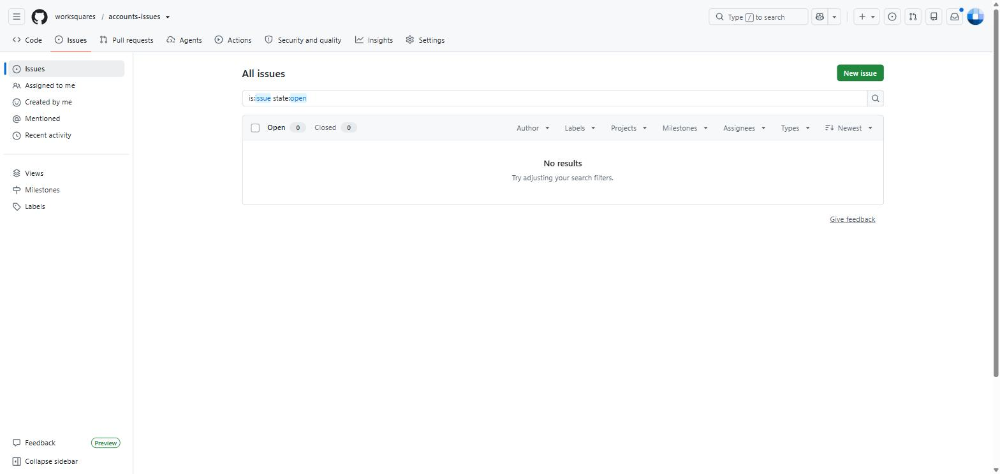
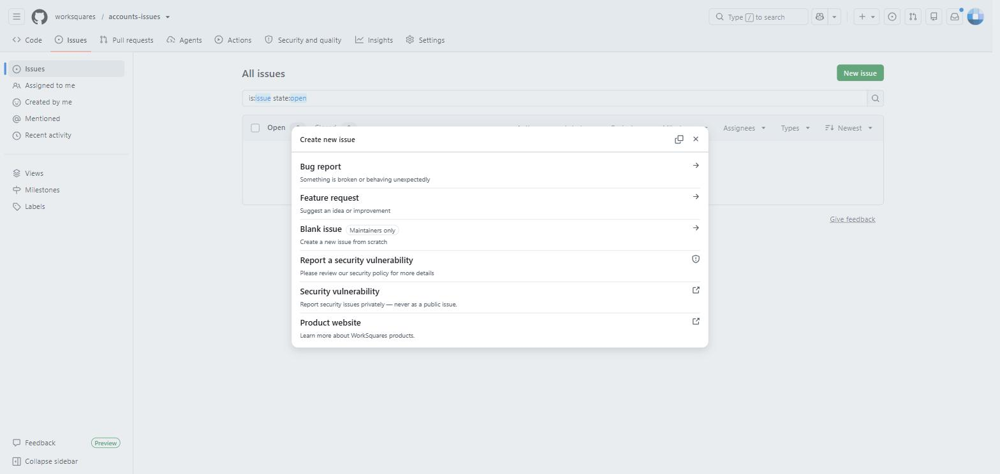
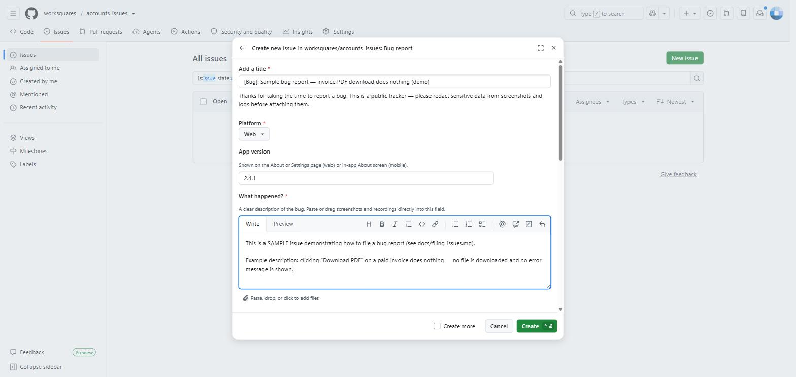
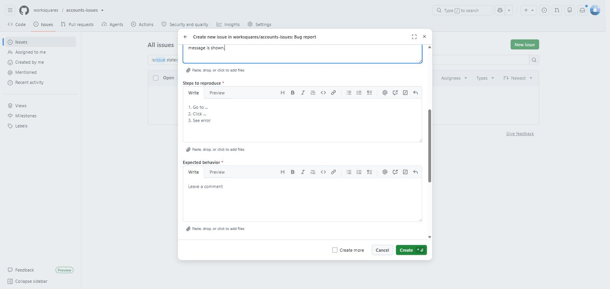
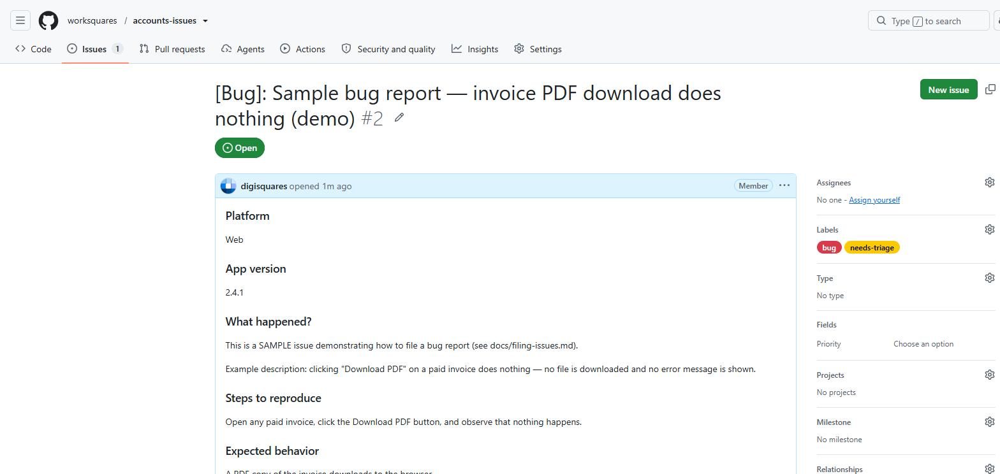
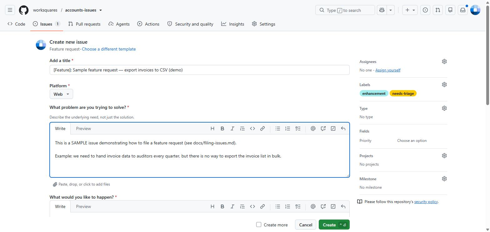

# How to file an issue — step by step

This guide walks through filing a **bug report** and a **feature request**, with screenshots. The screenshots were taken in the WorkSquares Accounts tracker; the flow is identical in every WorkSquares issue tracker. (If you are a maintainer, you will see a few extra tabs and options that regular visitors don't — the filing steps are the same.)

> **Before you start:** you need a free [GitHub account](https://github.com/signup) and must be signed in to file an issue. And remember — this is a **public** tracker: redact names, emails, financial data, API keys, and anything else sensitive from screenshots and logs before attaching them.

## Filing a bug report

### 1. Open the Issues tab and click "New issue"

From the repository's front page, click **Issues** in the top navigation, then the green **New issue** button.

### 2. Choose "Bug report"

A template chooser appears. Pick **Bug report**.

Notes on the other entries:

- **Blank issue** is available to maintainers only — please use the forms.
- **Report a security vulnerability** is the right choice for anything security-sensitive. It opens a private report that only maintainers can see — never file security problems as a public issue.

### 3. Fill in the form

The form asks for everything the team needs to reproduce and fix the problem: the platform, your app version, what happened, steps to reproduce, and what you expected instead.

**Attaching screenshots and recordings:** paste an image from your clipboard, or drag-and-drop the file, directly into any text field — look for the *"Paste, drop, or click to add files"* hint under each box. Images (PNG/JPG/GIF, up to 10 MB) and short screen recordings (MP4/MOV) are supported and help enormously.

Scroll down for the remaining fields:

### 4. Confirm and create

At the bottom, tick the two confirmation checkboxes (you searched existing issues; you redacted sensitive data), then click **Create**.

### 5. Done

Your issue is now filed and automatically labeled `bug` + `needs-triage`. The team will pick it up from there.

## Filing a feature request

Same start: **Issues → New issue**, but choose **Feature request** in the template chooser. Describe the *problem you are trying to solve* (the underlying need — this matters more than the specific solution), what you'd like to happen, and any workarounds you've tried. Mockups and screenshots are welcome — paste them straight into the form.

Click **Create** and you're done — the issue is labeled `enhancement` + `needs-triage` automatically.

## What happens next

- The team triages new issues and adjusts labels (platform, priority).
- You'll get GitHub notifications when someone replies; answer follow-up questions in the comment box at the bottom of your issue.
- When a fix ships, the issue is closed with a comment naming the release it landed in.

*Want to see what a finished issue looks like? Check the sample bug report and sample feature request pinned in this tracker's issue list — both were filed through these forms.*
